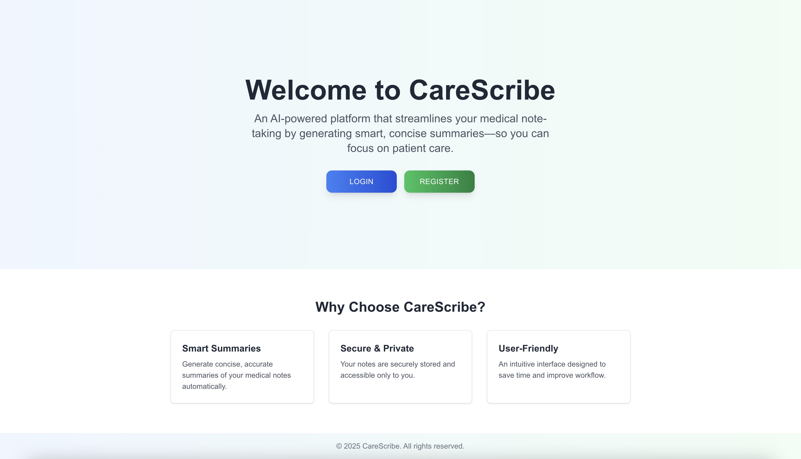

# AI RAG-Based CareScribe

**AI RAG-Based CareScribe** is an AI-powered, Retrieval-Augmented Generation (RAG) application designed to simplify note-taking for doctors. With secure user logins, powerful search capabilities to query patient details and symptoms, and smart AI-generated summaries, this project demonstrates full-stack development using modern technologies.

---

## Demo

- **Live Demo:** http://3.15.188.195:3000  

**Demo Login (Pre-loaded Notes):**
- **Email:** johndoe@example.com  
- **Password:** SecurePassword123

---

## Screenshots

### Main Page  


### Notes Page  


### Note Detail Page  


*(Place your screenshots in a folder named "screenshots" at the project root, or update the paths accordingly.)*

---

## Features

- **User Authentication:** Doctors can log in with their own credentials.
- **Personalized Note Taking:** Each doctor has their own account with individual notes.
- **Powerful Search:** Quickly search for keywords related to patient details, symptoms, or any content within the notes.
- **AI Summaries:** Leveraging Retrieval-Augmented Generation (RAG) with FastAPI and LangChain, the application generates concise summaries of lengthy notes.
- **Modern Frontend:** Built with Next.js (React, TypeScript, Tailwind CSS) for a responsive and dynamic user interface.
- **Robust Backend:** Developed with Node.js and Express to provide a secure and scalable API.
- **Efficient Database:** Uses PostgreSQL for reliable data storage.
- **Containerized Deployment:** Deployed to AWS using Docker Compose for simplified and fast deployment.

---

## Setup

### Frontend

1. **Navigate to the "frontend" folder:**
   ```
   cd frontend
   ```
2. **Install Dependencies:**
   ```
   npm install
   ```
3. **Create a ".env.local" File:**  
   In "frontend/.env.local", add:
   ```
   NEXT_PUBLIC_API_BASE_URL=http://localhost:5001/api
   ```
4. **Start the Development Server:**
   ```
   npm run dev
   ```
   Your Next.js app will run at http://localhost:3000.

### Backend

1. **Navigate to the "backend" folder:**
   ```
   cd backend
   ```
2. **Install Dependencies:**
   ```
   npm install
   ```
3. **Create a ".env" File:**  
   In "backend/.env", add:
   ```
   PORT=5001
   DB_USER=your_db_user
   DB_PASSWORD=your_db_password
   DB_HOST=postgres
   DB_PORT=5432
   DB_NAME=ai_med_notes
   JWT_SECRET=your_jwt_secret_here
   SUMMARIZATION_API_URL=http://ai:8000/api/summarize
   ```
4. **Start the Backend Server (Locally or via Docker):**
   - For local development:
     ```
     npm run dev
     ```
   - For production (after building):
     ```
     npm run build
     node dist/server.js
     ```
   Your Express server will run at http://localhost:5001.

### AI Service

1. **Navigate to the "ai-rag-service" folder:**
   ```
   cd ai-rag-service
   ```
2. **Install Python Dependencies:**
   ```
   pip install -r requirements.txt
   ```
3. **Create a ".env" File:**
   ```
   OPENAI_API_KEY=your_open_ai_key
   ```
4. **Start the FastAPI Service:**
   ```
   uvicorn main:app --host 0.0.0.0 --port 8000 --reload
   ```
   The AI service will run at http://localhost:8000.

### PostgreSQL

If running via Docker Compose, the PostgreSQL container is configured in your docker-compose.yml. Otherwise, ensure you have a PostgreSQL instance running locally with a database named "ai_med_notes" and a user that matches your backend .env settings.

---

## Docker Deployment on AWS

Your project is containerized with Docker. The following setup is used for AWS deployment:

- **Frontend Container:** Exposes port 3000.
- **Backend Container:** Exposes port 5001.
- **AI Service Container:** Exposes port 8000.
- **PostgreSQL Container:** Exposes port 5432.

The "docker-compose.yml" (located in the "docker" folder) uses the following build context:
```
build:
  context: ../
  dockerfile: docker/Dockerfile.<service>
```
This ensures that Docker can access the "frontend", "backend", and "ai-rag-service" folders correctly. The environment variable for the backend summarization URL is set to "http://ai:8000/api/summarize" for internal Docker networking, while the frontend uses the public IP.

To deploy, run the following command from the "docker" folder on your AWS instance:
```
sudo docker-compose up --build -d
```

---

## Contributing

Contributions are welcome! Please fork the repository and submit a pull request with improvements or new features. If you have any ideas or feedback, feel free to open an issue.

---

## Author

Created by Sudhanshu Jadhav

---

*Note: This project is a proof-of-concept to showcase full-stack development and containerized deployment using React, Node.js, PostgreSQL, FastAPI, and Docker on AWS. Future improvements could include additional features, enhanced security, and more robust error handling.*